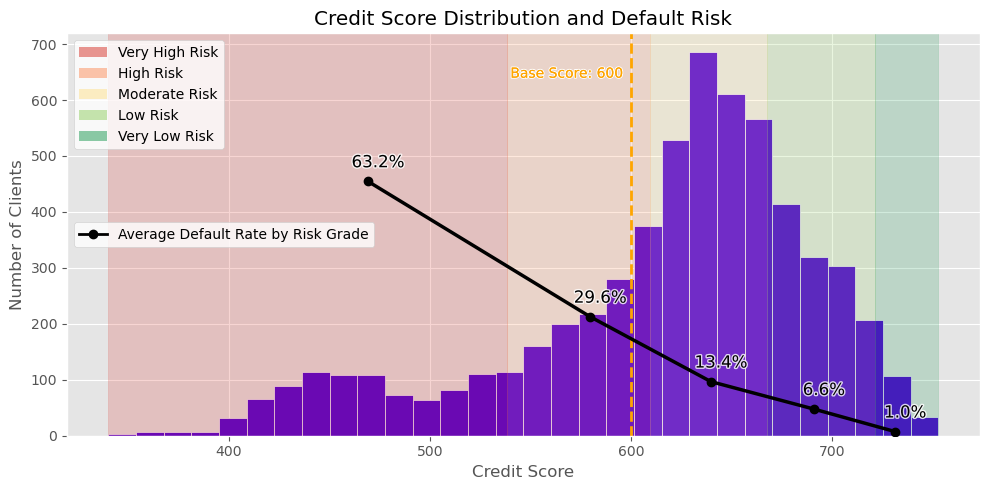
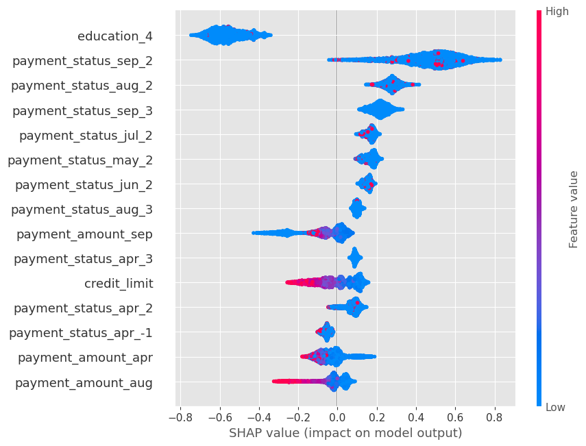

# Credit Risk Scoring

A machine learning project for estimating the **Probability of Default (PD)** of credit card clients and transforming these probabilities into an interpretable **credit score**.

The project compares a traditional **Logistic Regression** model with **XGBoost**, evaluates the quality of the predicted probabilities, and uses the final model to construct risk scores and credit risk grades.

## Dataset

The project uses the [Default of Credit Card Clients](https://archive.ics.uci.edu/dataset/350/default+of+credit+card+clients) dataset from the UCI Machine Learning Repository.

The original dataset contains:

* 30,000 credit card clients
* 23 predictor variables
* Demographic information
* Credit limits
* Six months of repayment history
* Bill and payment amounts
* A binary default target

Approximately **22.1% of clients defaulted**.

During data cleaning, 35 exact duplicate observations were removed and undocumented categorical values were grouped into appropriate `Other / Unknown` categories.

## Methodology

The project follows a compact credit risk modeling workflow:

1. Exploratory Data Analysis
2. Data preprocessing
3. Logistic Regression baseline
4. XGBoost modeling and hyperparameter tuning
5. Model comparison
6. Probability calibration assessment
7. Credit score construction
8. Risk grade segmentation
9. SHAP model explainability

The dataset was split into **80% training and 20% testing**, using stratified sampling to preserve the default rate.

Categorical variables were encoded using One-Hot Encoding. Numerical variables were standardized for Logistic Regression, while XGBoost used their original scale.

## Model Performance

| Model               |   Accuracy |  Precision | Recall |     F1 |    ROC-AUC |     PR-AUC |
| ------------------- | ---------: | ---------: | -----: | -----: | ---------: | ---------: |
| Logistic Regression |     0.8190 |     0.6676 | 0.3620 | 0.4694 |     0.7689 |     0.5411 |
| XGBoost Baseline    |     0.8123 |     0.6290 | 0.3695 | 0.4656 |     0.7644 |     0.5258 |
| **XGBoost Tuned**   | **0.8195** | **0.6743** | 0.3560 | 0.4659 | **0.7903** | **0.5584** |

The tuned XGBoost model achieved the strongest discrimination and was selected as the final model.

Because the main objective is to estimate and rank **Probability of Default**, ROC-AUC and PR-AUC were prioritized over performance at the default classification threshold of 0.5.

The predicted probabilities were also reasonably calibrated. XGBoost achieved a **Brier Score of 0.133**, compared with **0.137** for Logistic Regression.

## Credit Score Construction

The final XGBoost probabilities were transformed into an odds-based credit score.

The odds of non-default are defined as:

$$
\text{Odds(PD)} = \frac{1-PD}{PD}
$$

and the score as:

$$
\text{Score(PD)} =
\text{Offset} +
\text{Factor . }\ln(\text{Odds(PD)})
$$

The score was configured with:

* **Base Score:** 600
* **Base Odds:** average default odds in the training portfolio
* **PDO:** 50 Points to Double the Odds

Therefore, a score near **600 represents approximately the average credit risk of the training population**, while every doubling of the odds of non-default increases the score by 50 points.

The resulting score showed a clear inverse relationship with observed credit risk: the default rate fell from approximately **70% in the lowest score decile to 3% in the highest**.

## Risk Grades

For easier interpretation, predicted probabilities were divided into five project-specific risk grades:

| Risk Grade | Probability of Default |
| ---------- | ---------------------: |
| Very Low   |                   < 5% |
| Low        |               5% – 10% |
| Moderate   |              10% – 20% |
| High       |              20% – 40% |
| Very High  |                  ≥ 40% |

Observed default rates decreased consistently across the risk grades, from 63.2% in the Very High Risk group to 1.0% in the Very Low Risk group.

<p align="center">
  
</p>

The score provides a clear separation between clients with different levels of observed credit risk.

## Model Explainability

SHAP was used to understand the main factors driving the XGBoost predictions.

<p align="center">
  
</p>

Repayment behavior emerged as the primary driver of credit risk. Recent payment delays, particularly delays of two or more months, generally increased predicted default risk, while higher payment amounts and credit limits tended to reduce it.

## Technologies

* Python
* pandas
* NumPy
* Matplotlib
* scikit-learn
* XGBoost
* SHAP

## Repository

```text
credit-risk-scoring/
│
├── credit_risk_scoring.ipynb
└── README.md
```

The complete analysis, preprocessing, modeling, credit score construction, and explainability workflow is available in the notebook.

## Disclaimer

The credit score and risk grades developed in this project are intended solely as a demonstration of credit risk modeling techniques.

They are project-specific and should **not** be interpreted as an official FICO score, commercial credit score, or real-world lending policy.
